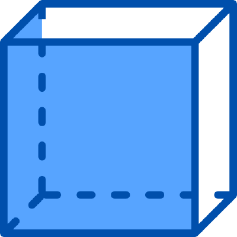

# web-container

[](https://github.com/RichardLitt/standard-readme)



The [`web-container`](https://github.com/augejs/augejs.github.io) is one of micro-frontend solutions on top of Web Virtualization.

:star2: Star us on GitHub — it helps! :clap:

https://github.wdf.sap.corp/xweb/web-container

## Table of Contents

- [web-container](#web-container)
  - [Table of Contents](#table-of-contents)
  - [Description](#description)
  - [Background](#background)
  - [What is Micro Frontends](#what-is-micro-frontends)
  - [What is a web-container](#what-is-a-web-container)
    - [`web-container` Model](#web-container-model)
    - [`web-container` Cross-application communication Model](#web-container-cross-application-communication-model)
    - [`web-container` Testing Model](#web-container-testing-model)
    - [`web-container` Virtualization Model](#web-container-virtualization-model)
  - [Usage](#usage)
  - [Examples](#examples)
  - [Related Efforts](#related-efforts)
  - [Maintainers](#maintainers)

## Description

The [`web-container`](https://github.com/augejs/augejs.github.io) is one of micro-frontend solutions on top of Web Virtualization.

## Background

For now the frontend’s technology stack is still in changing tempestuously and frequently. We need to find a way to insulate these varieties.

The concept of Micro frontend have been mentioned by ThoughtWorks technology radar in 2016. In recent years, micro-service have exploded in popularity, with many organizations using this architectural style to avoid the limitations of large, monolithic backends.

For the frontend side,  We need to face these similar issues just like the backend. But, unfortunately  there’s very slow growth in the frontend side comparing to the backend side.
So, I think the key is `Containerized Applications`, How to achieve the target’s technology is `Web Virtualization`.

## What is Micro Frontends

> https://martinfowler.com/articles/micro-frontends.html

In short, micro frontends are all about slicing up big and scary things into smaller, more manageable pieces, and then being explicit about the dependencies between them.

Our technology choices, our codebases, our teams, and our release processes should all be able to operate and evolve independently of each other, without excessive coordination. -- martinfowler

## What is a web-container

[`web-container`](https://github.com/augejs/augejs.github.io) The `web-container` is one of micro-frontend solutions on top of Web Virtualization. It has an isolate runtime environment(that means dom, javascript, css) in the host browser environment.

### `web-container` Model


### `web-container` Cross-application communication Model


### `web-container` Testing Model


### `web-container` Virtualization Model


Fot now the virtualization solution is on top of function closure. But this is not the standard, maybe we can use [Realms](https://github.com/tc39/proposal-realms/blob/main/explainer.md#Introduction) in the future.

## Usage

```javascript
npm install
npm run start
```

## Examples

+ http://127.0.0.1:3002/example-hijack.html
+ http://127.0.0.1:3002/example-permission.html
+ http://127.0.0.1:3002/example-postmessage.html
+ http://127.0.0.1:3002/example-stack.html


## Related Efforts

- [Art of Readme](https://github.com/noffle/art-of-readme) - 💌 Learn the art of writing quality READMEs.
- [open-source-template](https://github.com/davidbgk/open-source-template/) - A README template to encourage open-source contributions.

## Maintainers

[x-web](https://github.wdf.sap.corp/xweb).
